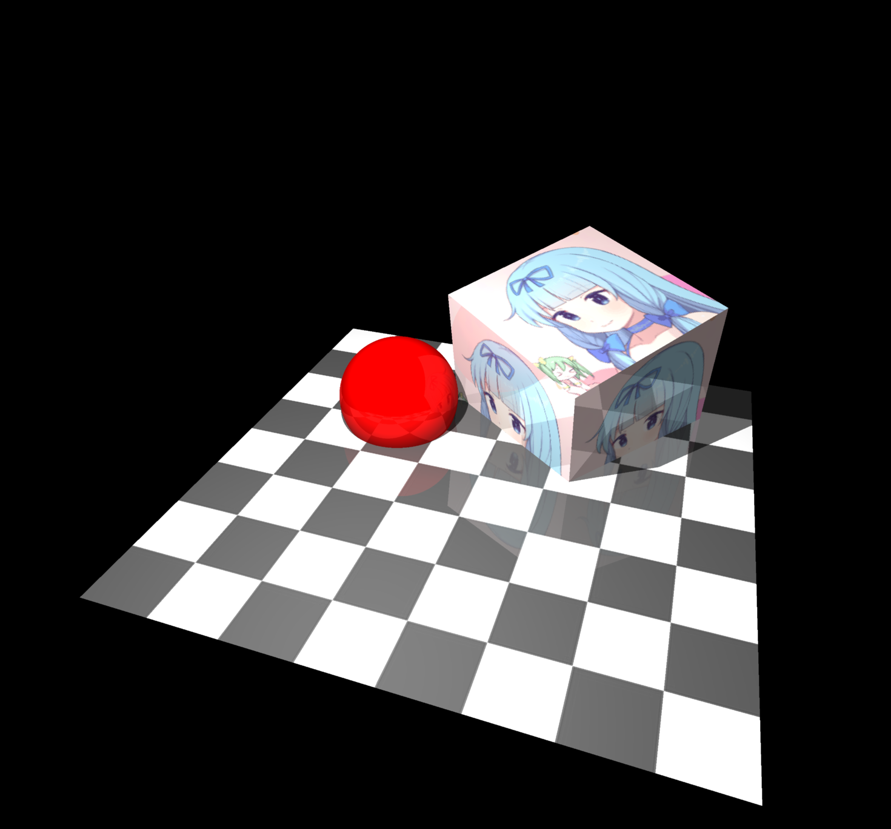

<!--
 * @Author: Wh_Xcjm
 * @Date: 2025-01-04 14:19:44
 * @LastEditor: Wh_Xcjm
 * @LastEditTime: 2025-01-12 15:25:39
 * @FilePath: \大作业\README.md
 * @Description: 
 * 
 * Copyright (c) 2025 by WhXcjm, All Rights Reserved. 
 * Github: https://github.com/WhXcjm
-->

# 一个小型绘制系统

Version: 1.0.0

渲染效果预览图

To-do list：

- [ ] import和export
- [x] 物体类建立
- [x] 光线追踪融合【重点】
- [x] 噪点问题
- [x] 回调函数修复
- [x] 视角修复
- [ ] 添加球体贴图支持
- [x] 平移旋转物体 & 实时渲染
- [x] 平移旋转视图 & 与自动旋转耦合 & 实时渲染
- [ ] 物体重命名、删除物体
- [ ] 写报告【重点】